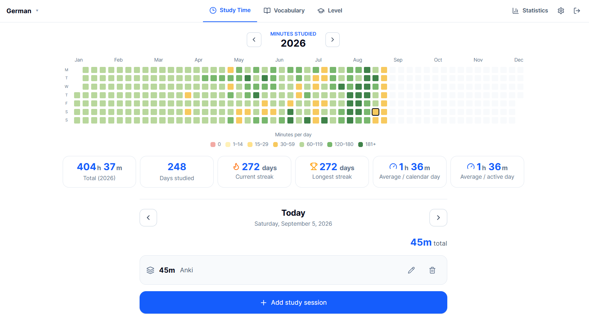
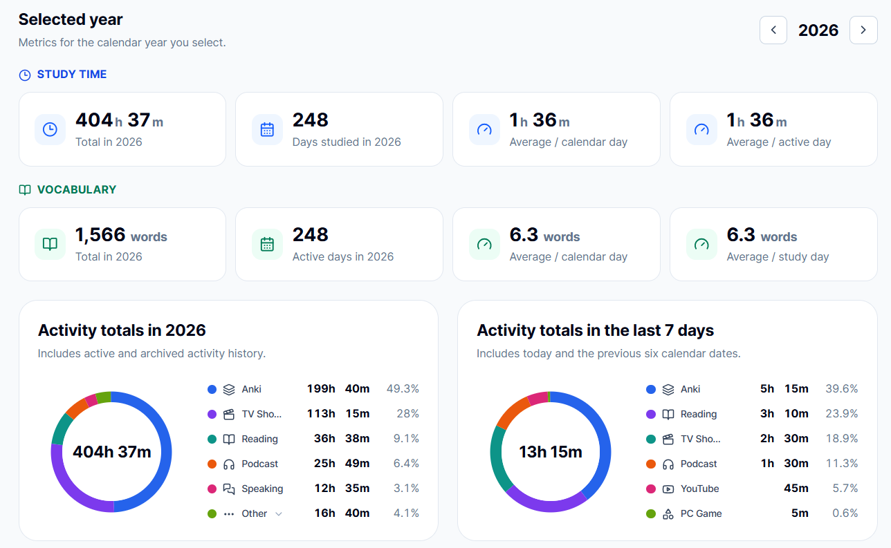
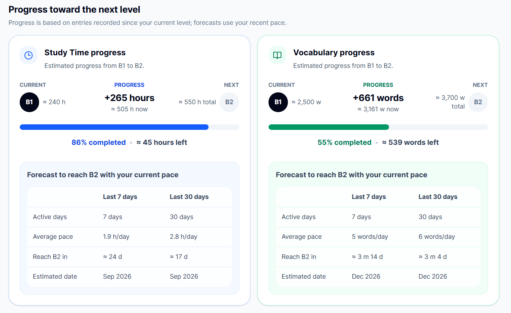
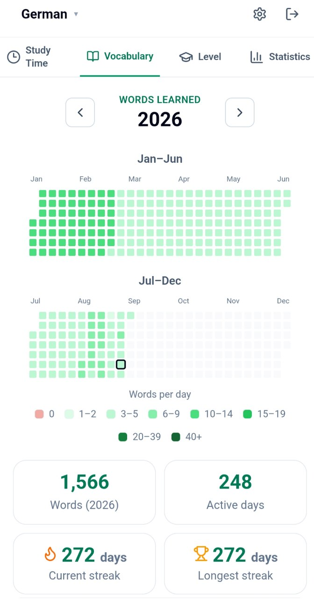
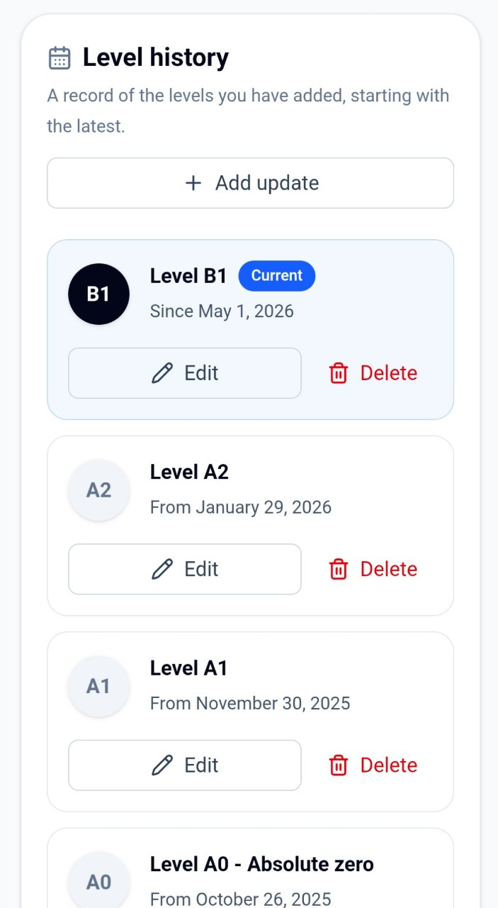

# Language Tracker

A deployed, responsive web application for recording language-learning
time, newly learned vocabulary, and self-declared CEFR progress on private
language boards.

[Try the live application](https://language-tracker-app.vercel.app/) ·
[Install on your phone](https://language-tracker-app.vercel.app/install) ·
[Read the product specification](docs/PRODUCT_SPEC.md) ·
[Explore the documentation](docs/README.md)

## Project status

Product Phases 0–5 and production launch gates R0–R5 are complete. The
application is deployed on Vercel with a separate production Supabase project,
custom SMTP, encrypted off-site backups, a successful restore rehearsal, and
approved desktop/mobile smoke tests. Operations readiness and controlled soft
launch remain tracked in the
[production launch runbook](docs/development/PRODUCTION_LAUNCH.md).

## Screenshots

### Study Time

### Statistics and progress forecasts

### Mobile experience

  
  

## Highlights

- Email/password authentication with confirmation and password recovery.
- Private, per-user data protected by PostgreSQL Row Level Security.
- Up to six language boards and a reusable global activity catalog per user.
- Exact study-time logging for past, present, and future dates.
- Atomic, idempotent date-range entry without overwriting existing sessions.
- Separate Study Time and Vocabulary heatmaps with fixed, comparable thresholds.
- One editable daily vocabulary total per board and date.
- Board-scoped totals, averages, active days, streaks, distributions, and
  seven-/thirty-day activity analysis.
- User-declared CEFR history with transparent, approximate Study Time and
  Vocabulary forecasts.
- Suggested weekly learning mixes and activity-average comparisons.
- Responsive, accessible English interface with system, light, and dark themes.

## Technology

- Next.js 16 App Router and React 19
- Strict TypeScript
- Tailwind CSS 4
- Supabase Auth and PostgreSQL with Row Level Security
- Vercel
- Vitest, Playwright, and pgTAP

## Install on your phone

Language Tracker is an installable web app; it does not require an App Store or
Google Play download. Open the [installation page](https://language-tracker-app.vercel.app/install)
on your phone. On Android, use the available **Install app** button or the
browser menu. On iPhone or iPad, open **Share** and choose **Add to Home Screen**.
The installed app uses the same account and data as the website and requires an
internet connection; offline access is not supported.

## Local development

### Prerequisites

- Node.js 22
- pnpm 10.22
- Docker Desktop or another Docker-compatible runtime for the local Supabase
  stack and database tests

### Setup

1. Clone the repository and enter its directory.
2. Run `pnpm install --frozen-lockfile`.
3. Copy `.env.example` to `.env.local`.
4. Follow the [Supabase setup guide](docs/development/SUPABASE_SETUP.md) to
   configure a hosted or local project.
5. Run `pnpm dev` and open [http://localhost:3000](http://localhost:3000).

For a production-like local check, run `pnpm build` followed by `pnpm start`.
The preserved Study Time design prototype is available at `/demo` while the
development server is running.

Never commit `.env.local`, recovery codes, database passwords, or a Supabase
service-role key. Browser code receives only the publishable key.

## Quality checks

| Command             | Purpose                                                   |
| ------------------- | --------------------------------------------------------- |
| `pnpm format:check` | Check formatting with Prettier                            |
| `pnpm lint`         | Run ESLint                                                |
| `pnpm typecheck`    | Run strict TypeScript checks                              |
| `pnpm test`         | Run the Vitest unit suite                                 |
| `pnpm test:e2e`     | Run Playwright desktop and mobile browser checks          |
| `pnpm build`        | Create a production Next.js build                         |
| `pnpm db:reset`     | Rebuild local Supabase from version-controlled migrations |
| `pnpm db:test`      | Run pgTAP database, constraint, and RLS tests             |
| `pnpm db:types`     | Regenerate TypeScript types from the local schema         |

The database commands require a Docker-compatible runtime. The GitHub browser
job starts an isolated Supabase stack and creates a confirmed E2E-only user;
without generated local test credentials, protected E2E tests skip rather than
accessing a hosted account.

## Documentation

The [documentation home](docs/README.md) provides role-based reading paths and
the complete requirements set. Primary engineering documents are:

- [Product specification](docs/PRODUCT_SPEC.md)
- [Architecture](docs/ARCHITECTURE.md)
- [Implementation plan](docs/IMPLEMENTATION_PLAN.md)
- [Requirements traceability matrix](docs/requirements/TRACEABILITY_MATRIX.md)
- [Supabase setup and verification](docs/development/SUPABASE_SETUP.md)
- [Production launch runbook](docs/development/PRODUCTION_LAUNCH.md)
- [Production operations](docs/development/OPERATIONS.md)

Code, identifiers, database objects, UI copy, and project documentation are
written in English. Product discussions may be conducted in Russian.
