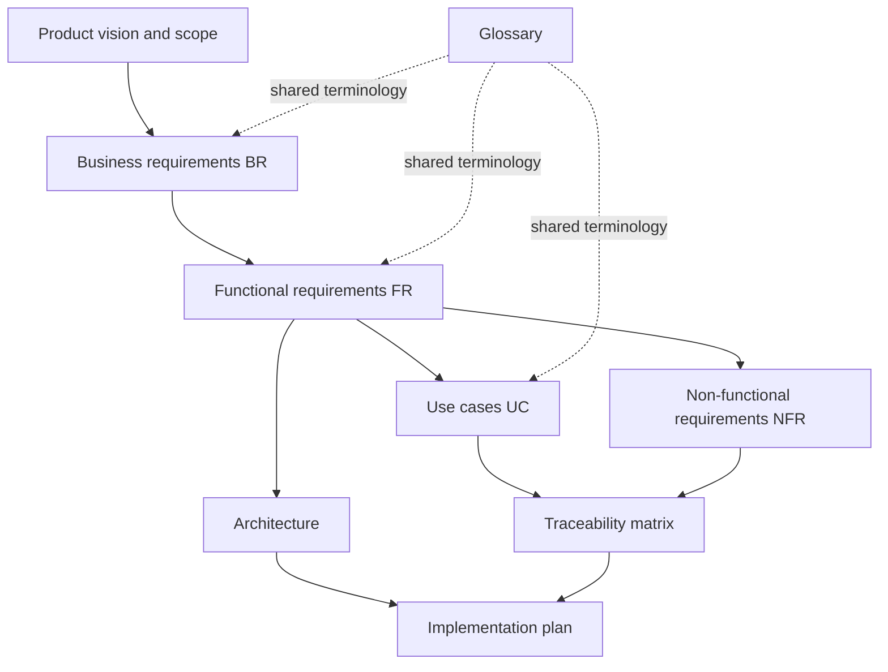

# Language Tracker Documentation

This directory is the documentation home for Language Tracker. It is organized so that a product owner, designer, engineer, or tester can start from the same approved product baseline and follow the level of detail relevant to their work.

**Current status:** Phases 0 and 1 are complete and merged. The product owner
approved the production-backed Phase 1 Study Time experience on desktop and a
physical mobile browser. Phase 2 atomic batch entry creation is in progress.

## Start here

| Reader                       | Recommended path                                                                                                                                                                  |
| ---------------------------- | --------------------------------------------------------------------------------------------------------------------------------------------------------------------------------- |
| Product owner or stakeholder | [Product vision](requirements/PRODUCT_VISION.md) → [Business requirements](requirements/BUSINESS_REQUIREMENTS.md) → [Product specification](PRODUCT_SPEC.md)                      |
| Designer or UX reviewer      | [Product vision](requirements/PRODUCT_VISION.md) → [Use cases](requirements/USE_CASES.md) → [Functional requirements](requirements/FUNCTIONAL_REQUIREMENTS.md)                    |
| Engineer                     | [Functional requirements](requirements/FUNCTIONAL_REQUIREMENTS.md) → [Non-functional requirements](requirements/NON_FUNCTIONAL_REQUIREMENTS.md) → [Architecture](ARCHITECTURE.md) |
| QA engineer                  | [Use cases](requirements/USE_CASES.md) → [Traceability matrix](requirements/TRACEABILITY_MATRIX.md) → [Implementation plan](IMPLEMENTATION_PLAN.md)                               |
| New project contributor      | [Glossary](requirements/GLOSSARY.md) → [Product specification](PRODUCT_SPEC.md) → [Architecture](ARCHITECTURE.md)                                                                 |

## Documentation map

## Requirements set

- [Product vision and scope](requirements/PRODUCT_VISION.md) — problem, outcomes, users, boundaries, assumptions, and product context.
- [Business requirements](requirements/BUSINESS_REQUIREMENTS.md) — business outcomes and rules identified as `BR-*`.
- [Functional requirements](requirements/FUNCTIONAL_REQUIREMENTS.md) — observable system behavior identified as `FR-*` with acceptance criteria.
- [Non-functional requirements](requirements/NON_FUNCTIONAL_REQUIREMENTS.md) — security, privacy, accessibility, performance, reliability, and maintainability constraints identified as `NFR-*`.
- [Use cases](requirements/USE_CASES.md) — end-to-end user interactions identified as `UC-*`.
- [Traceability matrix](requirements/TRACEABILITY_MATRIX.md) — links business intent to functionality, use cases, and planned verification.
- [Glossary](requirements/GLOSSARY.md) — approved domain terminology.

## Engineering documents

- [Product specification](PRODUCT_SPEC.md) — approved narrative baseline for MVP behavior.
- [Architecture](ARCHITECTURE.md) — system boundaries, security model, data model, and technical decisions.
- [Implementation plan](IMPLEMENTATION_PLAN.md) — the current Phase 0–4 delivery sequence, review milestones, risks, exit criteria, and definition of done.
- [Supabase setup and verification](development/SUPABASE_SETUP.md) — hosted/local setup, migrations, generated types, authentication redirects, and Phase 0 checks.
- [Repository instructions](../AGENTS.md) — rules that apply to automated and human contributors.

## Documentation conventions

The requirements structure is inspired by ISO/IEC/IEEE 29148 principles: each requirement is necessary, unambiguous, singular, feasible, and verifiable.

### Requirement identifiers

| Prefix     | Meaning                               | Example        |
| ---------- | ------------------------------------- | -------------- |
| `BR`       | Business requirement or business rule | `BR-004`       |
| `FR-AUTH`  | Authentication function               | `FR-AUTH-003`  |
| `FR-BOARD` | Language-board function               | `FR-BOARD-005` |
| `FR-ACT`   | Activity-catalog function             | `FR-ACT-006`   |
| `FR-ENTRY` | Study-entry function                  | `FR-ENTRY-004` |
| `FR-HEAT`  | Heatmap function                      | `FR-HEAT-003`  |
| `FR-VOCAB` | Vocabulary-tracking function          | `FR-VOCAB-003` |
| `FR-CEFR`  | CEFR history and forecast function    | `FR-CEFR-004`  |
| `FR-STAT`  | Statistics function                   | `FR-STAT-007`  |
| `FR-UI`    | Cross-cutting interface function      | `FR-UI-002`    |
| `NFR`      | Non-functional requirement            | `NFR-SEC-001`  |
| `UC`       | Use case                              | `UC-05`        |

Identifiers are stable. A requirement may be revised, but its ID must not be reused for different behavior.

### Priority

The project uses MoSCoW prioritization:

- **Must** — required for MVP acceptance.
- **Should** — important, but the MVP remains usable without it if explicitly deferred.
- **Could** — useful enhancement outside the committed MVP core.
- **Won't (MVP)** — deliberately excluded from the MVP.

### Requirement status

- **Approved** — confirmed by the product owner and part of the MVP baseline.
- **Proposed** — awaiting product-owner confirmation.
- **Deferred** — intentionally moved beyond MVP.
- **Implemented** — delivered and verified against its acceptance criteria.

All requirements in the current requirements set are **Approved** unless explicitly marked otherwise.

## Source-of-truth policy

`PRODUCT_SPEC.md` remains the approved narrative baseline. The files in `docs/requirements/` are structured, traceable views of that baseline. If a conflict is found, implementation stops until the product owner resolves it, and all affected documents are updated together.

## Change control

A product change should include:

1. the reason for the change;
2. the affected `BR`, `FR`, `NFR`, and `UC` identifiers;
3. updated acceptance criteria;
4. architecture or data implications, if any;
5. updated traceability and planned tests;
6. product-owner approval for scope or behavior changes.

Documentation changes are versioned in Git and reviewed through the same branch and pull-request workflow as code.
