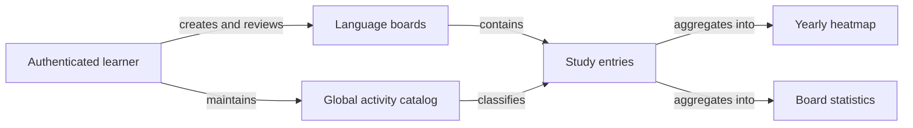

# Product Vision and Scope

## 1. Document purpose

This document explains why Language Tracker exists, who it serves, and what the MVP will and will not deliver. Detailed behavior is defined in the [functional requirements](FUNCTIONAL_REQUIREMENTS.md).

## 2. Vision statement

For independent foreign-language learners who want a clear record of consistent practice, Language Tracker is a private responsive web application that records exact study time on separate language boards and turns that history into an understandable yearly heatmap and board-specific statistics.

Unlike social habit platforms or generic time trackers, Language Tracker focuses on fast language-study logging, activity-specific history, and motivating visual continuity without public profiles, social pressure, or unrelated project-management features.

## 3. Problem statement

Language learners often study through several activities—reading, speaking, grammar, flashcards, media, and custom exercises—but their time is fragmented across tools or not recorded at all. They need a low-friction way to answer:

- How much time did I spend on this language?
- On which days did I study?
- Which activities receive most of my time?
- How consistent is my practice?
- How has my study pattern changed over days, weeks, months, and years?

## 4. Target user

### Primary persona: independent language learner

The primary user:

- studies one or more foreign languages;
- uses several learning activities;
- wants private personal records rather than social comparison;
- may add several study sessions on one day;
- uses desktop and mobile browsers;
- values a quick logging flow and an understandable visual history.

The MVP has no administrator, coach, teacher, follower, or public viewer role.

## 5. Product outcomes

The MVP should enable the user to:

1. maintain an accurate private history of exact study minutes;
2. separate progress by language board;
3. log a study entry with minimal repeated input;
4. understand yearly consistency through a contribution-style heatmap;
5. understand totals, averages, active days, streaks, and activity distribution;
6. retain historical meaning when boards or activities are renamed or removed from active use.

## 6. Product context



## 7. MVP scope

### In scope

- Email/password registration, email confirmation, sign-in, sign-out, and password recovery.
- Strict isolation of each user's data.
- Up to six active language boards per user.
- A global activity catalog shared across the user's boards.
- Seven seeded activities and named custom activities.
- Study entries with date, activity, exact minutes, and optional comment.
- Past, present, and future study dates.
- Yearly board heatmap with fixed intensity thresholds.
- Board-specific totals, averages, active days, streaks, activity totals, and time distributions.
- Responsive English-language, light-theme interface.
- Safe archival that preserves historical entries and statistics.

### Out of scope for MVP

- Combined statistics across boards.
- Social features, public profiles, followers, sharing, or viewing another user's data.
- Payments, subscriptions, or monetization.
- Notifications or reminders.
- Administration interface.
- Import or export.
- Editable duration presets.
- Theme selection or dark mode.
- UI localization or language selection.
- Offline mode.
- Native mobile applications.

## 8. Assumptions

- The service will support up to approximately 100 registered users during MVP.
- The user has an internet connection while using the application.
- The browser's local date determines today and current calendar periods.
- A study entry represents a calendar date, not a time-of-day interval.
- The production environment will use Vercel and Supabase unless the architecture is explicitly revised.

## 9. Constraints

- Code, identifiers, database objects, documentation, and UI copy are English.
- Weeks always begin on Monday.
- Duration is stored as exact integer minutes.
- User data must be protected by PostgreSQL Row Level Security.
- Project-controlled development files and caches are stored on drive `D:` in the owner's environment.

## 10. Product success for MVP

The MVP is successful when a learner can complete the core loop without assistance:

```text
Authenticate → select a board → select a date → record study time → see the day and statistics update
```

Formal acceptance is defined by the requirements and tests linked in the [traceability matrix](TRACEABILITY_MATRIX.md).
